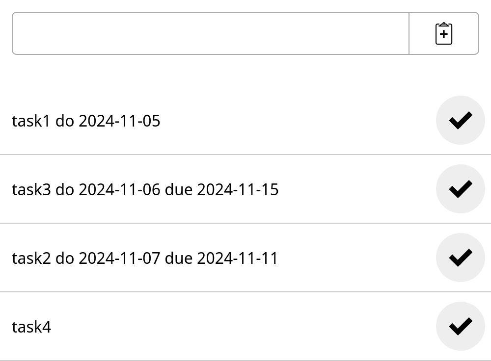
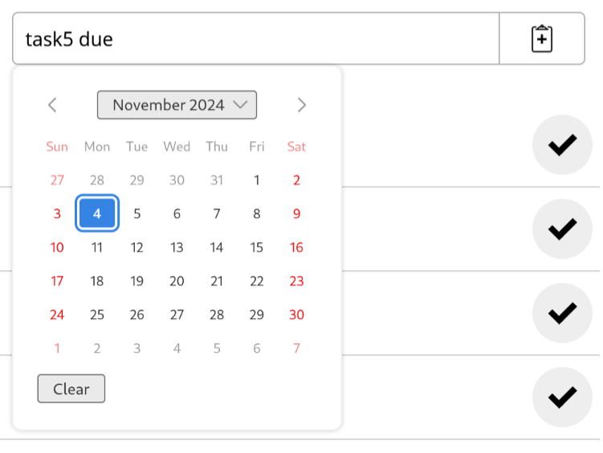
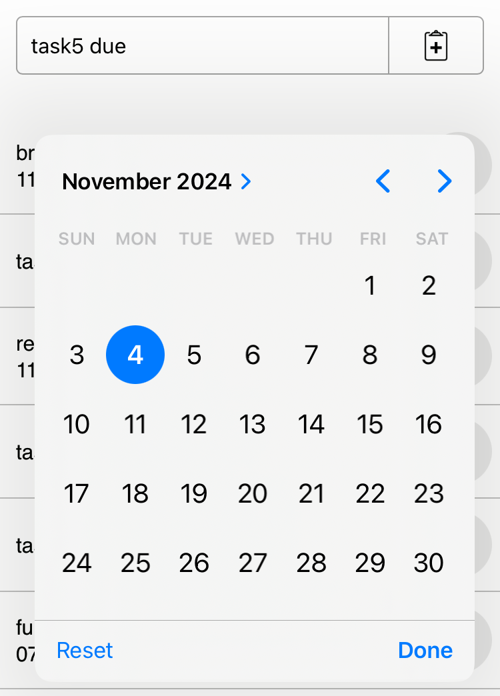

# Shopping list inpsired todo list web app

- Real-time syncing across devices (built on top of [mortie/shoptwist](https://github.com/mortie/shoptwist)).
- Editing is supported (new feature!).
- Items are sorted by do date, then due date, then the string itself.
  - Substrings of the form "do <date>" and "due <date>" specify a do / due date
  - If the do date is missing, its value is taken from the due date, and vice versa.
  - If both are missing, the date is assumed to be 9999-99-99.
- Typing "do " or "due " brings up a native date picker.

*Native date picker, Firefox 132*

*Native date picker, iOS 18 Safari*
